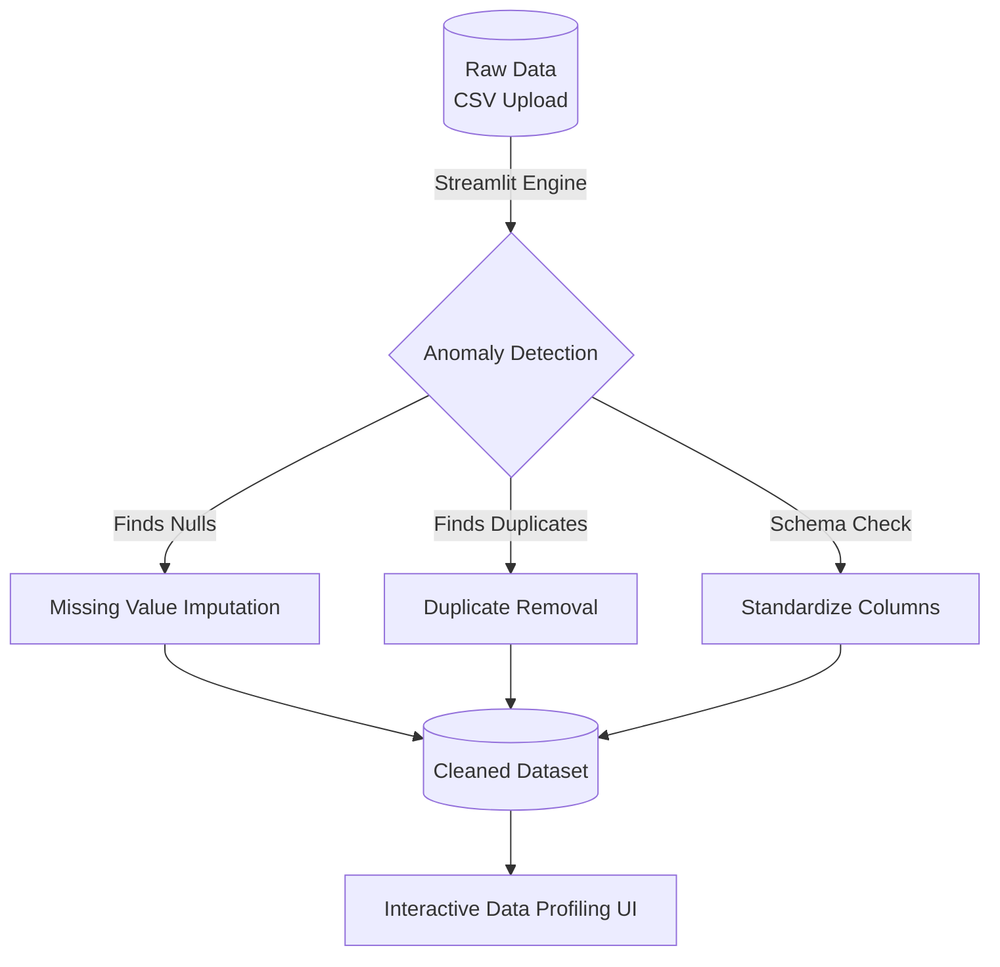
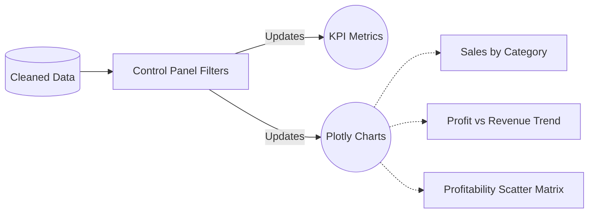

  <h1>🚀 CodSoft Data Analytics Internship</h1>
  
<i>A complete Data Engineering and Visualization Portfolio</i>

  
  
  
  

 

Welcome to my Data Analytics internship repository! This repository showcases my ability to build end-to-end data pipelines, from raw messy data to highly interactive, production-ready web dashboards.

---

## 🧹 Task 1: Universal Data Cleaning Pipeline

The first task focuses on ingesting messy datasets, automatically identifying anomalies, and cleaning them using a dynamic Streamlit engine. 

### ⚙️ Pipeline Architecture

### ✨ Key Features
* **Universal Upload:** Users can upload any CSV, and the engine automatically adapts to clean generic missing values and duplicates.
* **Superstore Specifics:** If no file is uploaded, it defaults to the Superstore dataset, performing advanced feature engineering (e.g., calculating `shipping_days` from Dates).
* **Interactive UI:** Built with premium glassmorphism CSS, offering a 4-tab workflow: Raw Inspection ➡️ Issues Found ➡️ Transformations ➡️ Final Output.

---

## 📈 Task 3: Executive Visualization Dashboard

*(Note: The code for Task 3 is kept locally for demonstration purposes)*

The third task elevates the cleaned data into an **Interactive Executive Dashboard** that allows stakeholders to derive actionable insights instantly.

### 🧠 Data Flow & Visualization

### ✨ Key Features
* **Dynamic Sidebar Controls:** Filter the entire dashboard in real-time by Region and Category.
* **Advanced Visuals:** Utilizes highly customized Plotly Express charts with transparent backgrounds, zero gridlines, and custom fonts.
* **Deep Analytics:** Features complex visualizations like Break-Even dashed lines on scatter plots to instantly spot loss-making products.

---

  <b>Developed by Ajay Vishwakarma</b>

