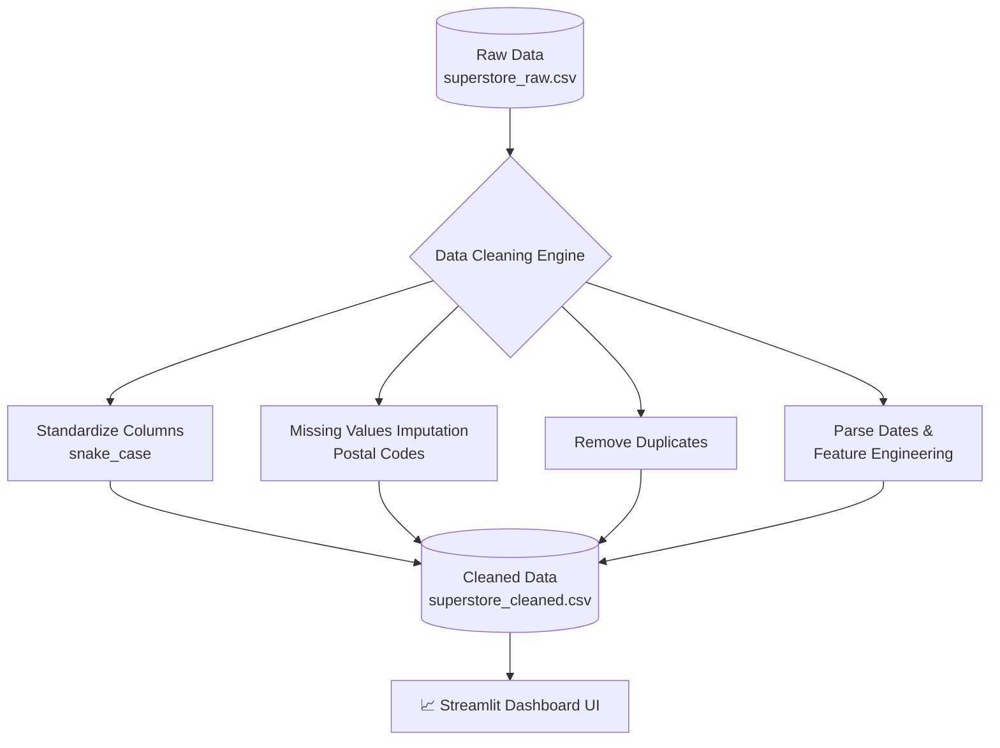

<div align="center">
  <h1>✨ Task 1: Data Cleaning & Preprocessing Dashboard</h1>
  <p><i>Transforming raw, messy datasets into clean, actionable analytics-ready data.</i></p>

  
  
  
</div>

<br>

## 📊 Pipeline Architecture

This project implements a complete data preprocessing pipeline. The flow of data is visualized below:



## 🌟 Key Features

- **Automated Cleaning Pipeline:** A robust `data_cleaning.ipynb` notebook that handles edge cases, duplicates, and missing values efficiently.
- **Feature Engineering:** Derives meaningful new metrics (e.g., `shipping_days`) directly from raw date columns.
- **Glassmorphism UI:** An interactive Streamlit Web App (`app.py`) built with a premium dark theme and glassmorphism KPI cards.
- **Visual Validation:** Interactive Plotly charts that allow users to visually inspect missing values and anomalies before and after cleaning.

## 🚀 How to Run the Dashboard

To experience the premium UI and see the cleaned data in action, run the following commands in your terminal:

```bash
# 1. Navigate to the Task 1 directory
cd task1_data_cleaning

# 2. Run the Streamlit Dashboard
streamlit run app.py
```

*The dashboard will automatically open in your default web browser at `http://localhost:8501/`.*

---
<div align="center">
  <b>Built for CodSoft Data Analytics Internship</b>
</div>
