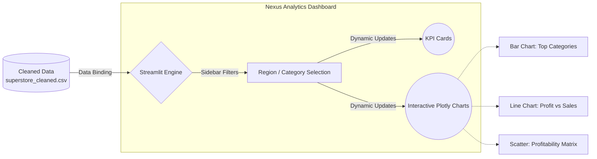

<div align="center">
  <h1>⚡ Task 3: Executive Visualization Dashboard</h1>
  <p><i>Real-time interactive business intelligence and analytics.</i></p>

  
  
  
</div>

<br>

## 📈 System Architecture

This interactive dashboard pulls from the central Cleaned Dataset to render live metrics and visualizations.



## 💎 Premium Features

- **Interactive Sidebar Filtering:** Filter the entire application state globally using Region and Category drop-downs.
- **Masterclass Plotly Charts:** Highly customized Plotly Express charts featuring:
  - Transparent backgrounds aligning seamlessly with the app theme.
  - Custom *Outfit* fonts and disabled gridlines for a clean UI.
  - Break-Even indicator lines (profit=0) dynamically plotted on scatter matrices.
- **Next-Gen CSS Glassmorphism:** Features a premium dark mode layout with floating, animated gradient KPI cards.

## 🚀 How to Launch the Dashboard

Launch the interactive dashboard to interact with the visual analytics:

```bash
# 1. Navigate to the Task 3 directory
cd task3_visualization

# 2. Run the Streamlit Dashboard (on port 8502 to avoid conflicts)
streamlit run app.py --server.port 8502
```

*The dashboard will automatically open in your default web browser at `http://localhost:8502/`.*

---
<div align="center">
  <b>Built for CodSoft Data Analytics Internship</b>
</div>
